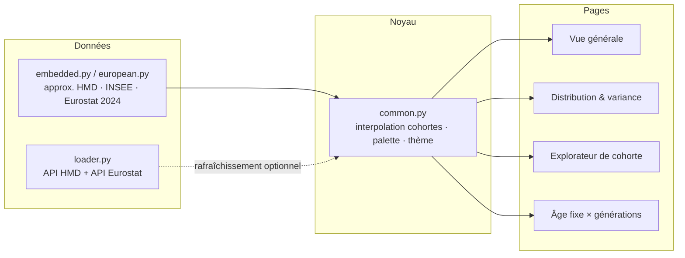

# 📊 Espérance de vie — France & Europe

Application **Streamlit** multi-pages analysant l'espérance de vie en France
(1900–2025) et en Europe, construite à partir des tables de mortalité
**HMD** (Human Mortality Database, mortality.org), de l'**INSEE**
(Vallin & Meslé) et d'**Eurostat** (table `demo_mlexpec`).

Une partie des données est **embarquée** (approximations démographiques
validées), une partie peut être **rafraîchie via API** (Eurostat sans
authentification, HMD avec credentials).

> Méthodes de calcul, formules, hypothèses et limites de représentativité :
> **[DOCUMENTATION.md](DOCUMENTATION.md)**.

## Architecture

Application **Streamlit** à quatre pages, alimentée par des données embarquées
(repli hors-ligne) et, en option, par les API HMD et Eurostat.



## Lancement

Le projet est géré avec [uv](https://docs.astral.sh/uv/) (Python 3.12) :

```bash
uv sync
uv run streamlit run app.py
```

## Les quatre vues

| Page | Contenu |
|---|---|
| 📈 **Vue générale** | Évolution de e₀ / e₆₀ / e₆₅ (1900–2025), annotations WWI/WWII/Covid, comparaison des 26 pays UE (barres triées, moyenne UE-27), tops 10 |
| 📐 **Distribution & variance** | Bande Q1–Q3 des âges au décès, médiane vs e₀, évolution de l'IQR (67 ans → 13 ans) : la **compression de la mortalité** |
| 👥 **Explorateur de cohorte** | Pour une année de naissance (1930–1990) et un sexe : courbe de survie interpolée, effectifs nés / vivants / décédés, espérance résiduelle 2025 |
| 🔄 **Âge fixe × générations** | À âge constant (35–90 ans), % de la génération encore en vie selon l'année d'observation — comparaison entre cohortes |

> Les graphiques sont **générés à la volée** par Plotly (thème clair/sombre suivant
> Streamlit) ; aucune image statique n'est stockée dans le dépôt. Chaque page
> propose un export **CSV** des données affichées.

## Choix techniques

| Cas | Choix retenu | Pourquoi |
|---|---|---|
| Données par défaut | Embarquées (`data/embedded.py`) | App utilisable **hors-ligne**, sans compte HMD ; API en option |
| Survie de cohorte | Interpolation linéaire d'ancres arrondies | Compacité, pas de credentials ; précision suffisante (**±5 %**) |
| Espérance résiduelle | Table **du moment** 2025 (INSEE/DREES) | Donnée disponible ; l'app avertit qu'elle **sous-estime** la survie réelle des générations |
| Quartiles HMD | Calculés sur la distribution des décès `dx` | Densité directe des âges au décès (médiane, IQR, écart-type) |
| Couleurs | Palette fixe par entité (femmes rose, hommes bleu, e₀ orange) | Lecture cohérente entre les quatre pages |

> Détail des formules et du patron décisionnel : [DOCUMENTATION.md](DOCUMENTATION.md).

## Résultats clés

| Indicateur | Femmes | Hommes |
|---|---|---|
| e₀ en 1900 → 2025 | **48,2 → 85,9 ans** (+37,7) | **43,4 → 80,3 ans** (+36,9) |
| IQR des âges au décès 1900 → 2025 | **67 → 13 ans** | **65 → 17 ans** |

- **Écart femmes − hommes** (e₀ 2025) : **5,6 ans**.
- **Compression de la mortalité** : les décès, autrefois étalés sur toute la vie,
  se concentrent aujourd'hui au-delà de **70 ans** (IQR féminin divisé par ~5).
- **Europe (Eurostat 2024, 26 pays)** : France **83,0 ans** au total, au-dessus de
  la moyenne **UE-27 (81,5 ans)** ; en tête Espagne et Suède (**83,7 ans**).

## Structure

```
├── app.py                        # point d'entrée Streamlit
├── common.py                     # palette, template Plotly, interpolation cohortes
├── pages/
│   ├── 01_vue_generale.py
│   ├── 02_distribution_variance.py
│   ├── 03_cohorte_explorer.py
│   └── 04_age_fixe_generations.py
└── data/
    ├── loader.py                 # téléchargement HMD + API Eurostat
    ├── embedded.py               # données approx. (quartiles, cohortes, naissances)
    └── european.py               # comparaison européenne Eurostat 2024
```

## Données HMD complètes (optionnel)

L'inscription gratuite sur [mortality.org](https://www.mortality.org) permet de
recalculer les vrais quartiles et l'écart-type depuis les tables 1x1 :

```bash
export HMD_USER="votre@email.com"
export HMD_PASSWORD="motdepasse"
uv run streamlit run app.py
```

ou en important directement `fltper_1x1.txt` / `mltper_1x1.txt` sur la page
**Distribution & variance**.

## Lint

```bash
uv run ruff check .
```

## Sources

- HMD — Human Mortality Database, [mortality.org](https://www.mortality.org)
- INSEE — tables de mortalité françaises (Vallin & Meslé), naissances France métropolitaine
- Eurostat — table `demo_mlexpec` (2024)
- DREES 2024 — espérance de vie résiduelle
- Wilmoth & Horiuchi (1999), Robine (2001) — compression de la mortalité

## Licences & composants

| Composant | Rôle | Licence |
|---|---|---|
| Streamlit | Interface web multi-pages | Apache-2.0 |
| Plotly | Graphiques interactifs | MIT |
| pandas | Manipulation de tableaux | BSD-3-Clause |
| numpy | Calcul numérique (quartiles, variance) | BSD-3-Clause |
| requests | Appels API HMD / Eurostat | Apache-2.0 |
| ruff | Lint (groupe `dev`) | MIT |
| **Ce projet** | Code applicatif | MIT — Copyright (c) 2026 floSa |

Données : HMD (mortality.org), Eurostat, INSEE et DREES — se reporter aux
conditions de chaque fournisseur pour toute réutilisation.

*Estimations approximatives : survie de cohorte estimée à ±5 %.*
