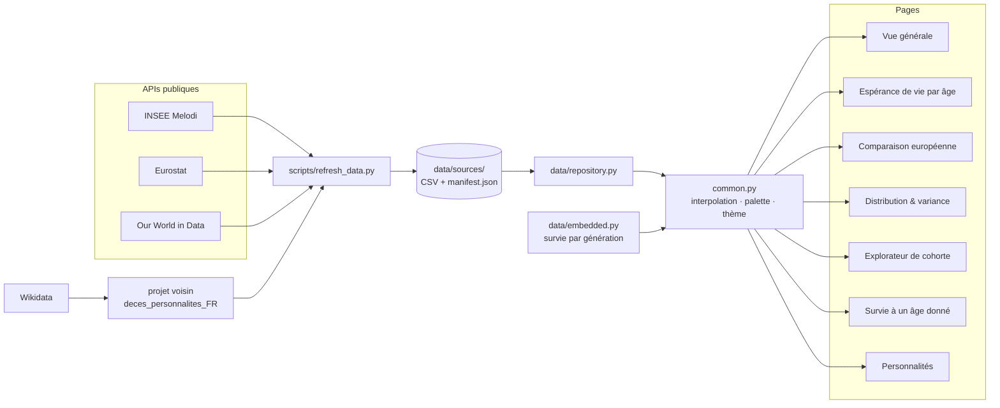

# Espérance de vie — France & Europe

**Application Streamlit multi-pages qui analyse l'espérance de vie en France (1816–2025) et la compare au reste de l'Europe, à partir des séries publiques de l'INSEE, d'Eurostat, d'Our World in Data et de Wikidata.**


Toutes les données sont **récupérées par API publique** et régénérables par une
commande. Aucun compte, aucune clé, aucun fichier à importer à la main.

> Méthodes de calcul, formules, hypothèses et limites : **[DOCUMENTATION.md](DOCUMENTATION.md)**.

## Lancement

Le projet est géré avec [uv](https://docs.astral.sh/uv/) (Python 3.12) :

```bash
uv sync
uv run streamlit run app.py
```

## Mettre à jour les données

Une seule commande interroge l'INSEE, Eurostat et Our World in Data, puis
réécrit `data/sources/` :

```bash
uv run python -m scripts.refresh_data
```

Chaque jeu produit un CSV **et** une entrée dans `data/sources/manifest.json`
consignant l'URL exacte, les paramètres de requête, le millésime déclaré par le
fournisseur et la date d'extraction. Le diff Git de ces fichiers est la trace de
ce qui a bougé d'un rafraîchissement à l'autre.

**Exception : les personnalités.** Leur collecte sur Wikidata prend plus d'une
demi-heure. Elle vit dans le projet voisin
`deces_personnalites_FR` (dossier voisin de celui-ci), et `refresh_data`
importe son fichier consolidé (chemin modifiable avec `--personnalites`).
Pour les mettre à jour : relancer d'abord la collecte là-bas, puis
`refresh_data` ici.

## D'où viennent les données

| Jeu | Source | Accès | Couverture |
|---|---|---|---|
| Espérance de vie par sexe (âges 0, 1, 20, 40, 60) | INSEE — API Melodi, `DS_DECES_MORTALITE_SERIES` (`EC_MEASURE=LEXPEC`) | Ouvert, sans jeton | 1946–2025 |
| Espérance de vie à tous les âges (0 à 95 ans) | Eurostat — `demo_mlexpec` | Ouvert | 1998–2024 |
| Espérance de vie, série longue (tous sexes) | Our World in Data — `grapher/life-expectancy`, d'après HMD | Ouvert (CC BY) | 1816–2023 |
| Naissances vivantes annuelles | INSEE — `DS_NAISSANCES_FECONDITE_SERIES` (`LVB_PLACE_REG`) | Ouvert | 1901–2025 |
| Distribution des âges au décès (`dx` → quartiles) | Eurostat — `demo_mlifetable` | Ouvert | 2014–2024 |
| Comparaison européenne | Eurostat — `demo_mlexpec` | Ouvert | dernière année publiée |
| Décès enregistrés par âge et sexe | Eurostat — `demo_magec` | Ouvert | 1990–2024 (métropole jusqu'en 1997) |
| Personnalités françaises décédées | Wikidata, via `deces_personnalites_FR` | Ouvert (CC0) | 1990–2025 |

Le périmètre géographique retenu est la **France métropolitaine**, constant sur
toute la profondeur historique — « France entière » intègre les DOM à partir de
1990 et créerait une rupture de série.

### Ce qui reste estimé

La **survie par génération** (pages « Explorateur de cohorte » et « Survie à un
âge donné ») n'a aucune source ouverte : aucune institution ne publie de
tables de mortalité par cohorte pour la France. Ces valeurs restent des
approximations dans `data/embedded.py`, précision estimée à **±5 %**. Il en va
de même des quartiles des âges au décès **avant 2014**, Eurostat ne remontant
pas plus loin ; la page concernée marque explicitement la frontière entre
estimé et mesuré.

## Architecture


```mermaid
flowchart LR
  subgraph Sources["APIs publiques"]
    insee[INSEE Melodi]
    euro[Eurostat]
    owid[Our World in Data]
  end
  wd[Wikidata] --> collecte[projet voisin<br/>deces_personnalites_FR]
  refresh[scripts/refresh_data.py]
  csv[(data/sources/<br/>CSV + manifest.json)]
  repo[data/repository.py]
  emb[data/embedded.py<br/>survie par génération]
  common[common.py<br/>interpolation · palette · thème]
  subgraph Pages
    p1[Vue générale]
    p2[Espérance de vie par âge]
    p3[Comparaison européenne]
    p4[Distribution & variance]
    p5[Explorateur de cohorte]
    p6[Survie à un âge donné]
    p7[Personnalités]
  end
  insee & euro & owid --> refresh --> csv --> repo --> common
  collecte --> refresh
  emb --> common
  common --> p1 & p2 & p3 & p4 & p5 & p6 & p7
```

## Les sept vues

Une question par page, une source, une période. C'est la règle qui structure
l'application : mélanger deux périmètres dans une même figure rendait les
graphiques illisibles.

| Page | Question | Source | Période |
|---|---|---|---|
| **Vue générale** | Comment l'espérance de vie a-t-elle évolué chez les femmes et les hommes ? | INSEE | 1946–2025 |
| **Espérance de vie par âge** | Combien d'années reste-t-il à vivre à un âge donné ? | Eurostat | 1998–2024 |
| **Comparaison européenne** | Où se situe la France dans l'UE ? | Eurostat | dernière année publiée |
| **Distribution & variance** | À quel âge meurt-on, et cet âge s'est-il resserré ? | Eurostat + estimations | 1900–2024 |
| **Explorateur de cohorte** | Parmi les personnes nées une année donnée, combien sont encore en vie ? | Estimations ±5 % | générations 1930–1990 |
| **Survie à un âge donné** | À âge constant, la survie progresse-t-elle d'une génération à l'autre ? | Estimations ±5 % | générations 1930–1990 |
| **Personnalités** | Les personnalités meurent-elles plus âgées que l'ensemble des Français ? Et, une à une, avant ou après l'âge qu'on pouvait leur prédire ? | Wikidata + Eurostat + INSEE | 1990–2024 |

Chaque graphique porte une note **« Comment lire ce graphique »**. Les
graphiques sont générés à la volée par Plotly (thème clair/sombre suivant
Streamlit) ; chaque page propose un export CSV.

## Choix techniques

| Cas | Choix retenu | Pourquoi |
|---|---|---|
| Provenance des données | Un CSV + une entrée de manifeste par jeu | Rendre le rafraîchissement vérifiable et le diff Git relisible |
| Quartiles des âges au décès | Calculés sur `dx` de la table de mortalité Eurostat | Densité directe des âges au décès, sans compte HMD |
| Série longue avant 1946 | OWID, tous sexes confondus | Seule source ouverte continue ; le détail par sexe n'existe pas avant 1946 |
| Survie de génération hors plage | Valeur de la dernière génération ayant atteint cet âge | Extrapoler produisait une survie qui remontait avec l'âge |
| Couleurs | Palette fixe par entité (femmes rose, hommes bleu, e₀ orange) | Lecture cohérente entre les sept pages |
| Découpage des pages | Une question, une source, une période par page | Une figure mêlant deux périmètres est illisible |
| Axe des années, page « par âge » | Fixé à 1998–2024 quel que soit l'âge | Un axe qui bouge avec le sélecteur rend deux sélections incomparables |
| Survie au-delà de 95 ans | Affichage borné au dernier âge documenté, écart signalé | Mieux vaut afficher moins que d'inventer une valeur |
| Point de comparaison des personnalités | Âge au décès de tous les Français morts la même période, pas l'espérance de vie | Comparer des décès à des décès ; l'espérance de vie décrit une génération fictive |
| Âge minimal, page Personnalités | Décès à 25 ans ou plus, des deux côtés | On devient rarement célèbre enfant : garder les décès d'enfants rajeunirait artificiellement la population |
| Sexe, page Personnalités | Toujours séparé | 83 % des personnalités sont des hommes, qui meurent plus jeunes |
| Âge prédit d'une personnalité | 60 ans + espérance de vie à 60 ans l'année de ses 60 ans | À la naissance, l'INSEE ne remonte qu'à 1946 et la mesure inclut les décès d'enfants |
| Référence de l'âge prédit | Même calcul sur tous les décès enregistrés | La prédiction sous-estime la survie, puisque la mortalité continue de baisser : l'ensemble des Français la dépasse aussi le plus souvent |
| Nuage de points | Année de décès en abscisse, un point par couple (année de décès, année de naissance) | Rendre visibles les 25 000 personnalités ; chaque année de décès est observée en entier, sans effet de fenêtre |

## Résultats clés

| Indicateur | Femmes | Hommes |
|---|---|---|
| e₀ en 2025 | **85,9 ans** | **80,4 ans** |
| IQR des âges au décès (2024, mesuré) | **12 ans** (78 → 90) | **17 ans** (71 → 88) |

- **Écart femmes − hommes** (e₀ 2025) : **5,5 ans**.
- **Creux de 1918** : l'espérance de vie tombe à **34,8 ans** (contre 43,0 en
  1917) sous l'effet conjugué de la guerre et de la grippe espagnole.
- **Compression de la mortalité** : les décès, autrefois étalés sur toute la
  vie, se concentrent aujourd'hui dans une fenêtre étroite — douze ans pour les
  femmes, dix-sept pour les hommes.
- **Europe (Eurostat 2024)** : France **83,0 ans**, au-dessus de la moyenne
  **UE-27 (81,5 ans)** ; en tête l'Espagne (**84,0 ans**) puis la Suède (83,8).
- **Personnalités (1990–2024, décès à 25 ans ou plus)** : les hommes célèbres
  meurent en moyenne **6,1 ans plus tard** que l'ensemble des Français (79,7
  contre 73,6 ans), un écart stable sur toute la période. Chez les femmes, **pas
  d'écart réel** (81,9 contre 81,4 ans). Ce n'est pas une preuve que la
  célébrité protège : vivre longtemps aide à devenir connu.
- **Avant ou après l'âge prédit** : 67 % des hommes célèbres meurent après
  l'âge qu'on pouvait leur prédire à 60 ans, contre 53 % de l'ensemble des
  Français. Chez les femmes, 63 % contre 61 %.
- **Une partie de l'écart masculin tient aux décès précoces** : les morts
  entre 25 et 59 ans pèsent 17 % des décès d'hommes dans la population, contre
  8 % chez les personnalités. Chez les femmes, ils pèsent autant des deux côtés.

## Structure

```
├── app.py                        # point d'entrée Streamlit
├── common.py                     # palette, thème Plotly, survie de génération
├── pages/                        # les sept vues (une question par page)
├── data/
│   ├── repository.py             # accès aux données générées
│   ├── sources/                  # CSV + manifest.json (régénérés)
│   ├── embedded.py               # estimations sans source ouverte
│   └── european.py               # nomenclature des pays UE-27
├── scripts/
│   ├── sources.py                # un fetcher par source, avec provenance
│   ├── refresh_data.py           # régénère data/sources/
│   └── check_pages.py            # rend les 8 pages et détecte les erreurs
└── tests/                        # invariants démographiques
```

## Qualité

```bash
uv run ruff check .                     # lint
uv run pytest -q                        # invariants démographiques
uv run python scripts/check_pages.py    # rendu des 8 pages
```

Les tests vérifient des propriétés qui doivent tenir quelles que soient les
valeurs : la survie décroît avec l'âge, elle ne régresse pas d'une génération à
la suivante, elle reste dans [0, 100], et aucune génération ne se voit attribuer
de survie à un âge qu'elle n'a pas atteint. Ce sont eux qui ont mis au jour un
creux de survie artificiel entre les générations 1963 et 1967.

## Sources

- INSEE — [API Melodi](https://api.insee.fr/melodi/), séries longues décès et naissances
- Eurostat — [`demo_mlexpec`](https://ec.europa.eu/eurostat/databrowser/view/demo_mlexpec), [`demo_mlifetable`](https://ec.europa.eu/eurostat/databrowser/view/demo_mlifetable)
- Our World in Data — [life expectancy](https://ourworldindata.org/life-expectancy), d'après la Human Mortality Database
- Eurostat — [`demo_magec`](https://ec.europa.eu/eurostat/databrowser/view/demo_magec), décès par âge et sexe
- Wikidata — personnalités décédées, via le projet `deces_personnalites_FR`
- Wilmoth & Horiuchi (1999), Robine (2001) — compression de la mortalité

## Licences

Code sous **MIT** — voir [LICENSE](LICENSE). Les **données** relèvent des
conditions de leurs producteurs (Licence Ouverte Etalab pour l'INSEE,
réutilisation Eurostat, CC BY pour OWID) ; le détail figure dans `LICENSE` et la
provenance exacte dans `data/sources/manifest.json`.

| Composant | Rôle | Licence |
|---|---|---|
| Streamlit | Interface web multi-pages | Apache-2.0 |
| Plotly | Graphiques interactifs | MIT |
| pandas | Manipulation de tableaux | BSD-3-Clause |
| numpy | Calcul numérique (quartiles, variance) | BSD-3-Clause |
| requests | Appels aux API | Apache-2.0 |
| ruff · pytest | Lint et tests (groupe `dev`) | MIT |
